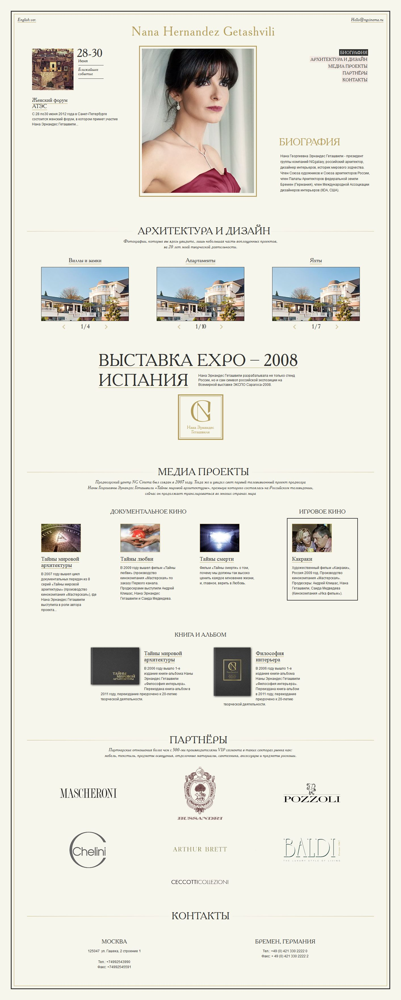

Робота відбіркового етапу UaWebChallenge
======
Досить цікавий макет, з задоволенням зверстав його ще й з "адаптивністю і лейзі-лоад картинками":)
###### Технології: Html5, Css3, JS, jQuery, Scss, reset.css, microformats.
###### Тести: IE7+ (так, навіть сьомий показує все як треба), Firefox29.0, Chrome34.0, Opera21.0, Safari5.1, Yandex.bro14.2

Пара моментів:
---
- В reset.css більшості елементів властивість `box-sizing` встановлена на `border-box`. Шкода що так не по дефолту...
- При роботі використовувались міксіни-велосипеди і була опробувана верстка майже-піксель-перфект. Давно хотів спробувать в дії "дивний" міксін написаний спеціально для таких ситуацій. Спс конкурсу за можливість!
- Розмітка валідна, а от з цсс є нюанси в плані валідності градієнтів. Хоча ті лінії можна було і зробить картинками.
- Ні ну класно, я не підтримував експлорерів нижче 8-9 а тут "причастився" сьомим, як для загального розвитку - норм.

А взагалі дякую організаторам UaWebChallenge за цікавий евент і годне завдання, вільний час був проведений з користю і задоволенням!
**Репозиторій на гітхаб** [https://github.com/orlovmax/uawebchallenge](https://github.com/orlovmax/uawebchallenge)

Демо
------
Жива демка: [http://orlovmax.github.io/uawebchallenge](http://orlovmax.github.io/uawebchallenge "Глянути резалт відбіркового туру UaWebChallenge")

Тестові скріншоти
------
**Скріни лежать в каталозі [test_screenshots](https://github.com/orlovmax/uawebchallenge/tree/master/test_screenshots/)**

- Тест відпоідності макету [almost_pixel-perfect](https://github.com/orlovmax/uawebchallenge/tree/master/test_screenshots/almost_pixel-perfect/)
- Тест сумісності браузерів, окрім експлореру, з нього скріни не отримав, але там все норм. [browser_compat](https://github.com/orlovmax/uawebchallenge/tree/master/test_screenshots/browser_compat/)
- Тест адаптивності [responsive](https://github.com/orlovmax/uawebchallenge/tree/master/test_screenshots/responsive/)

---

